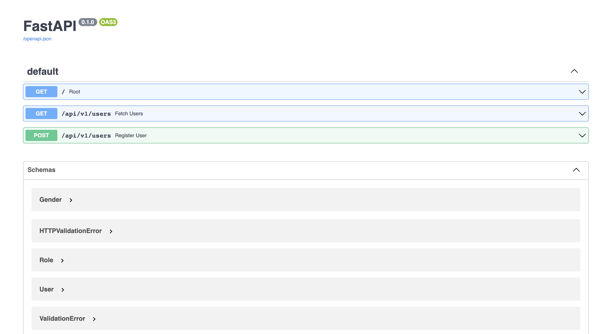
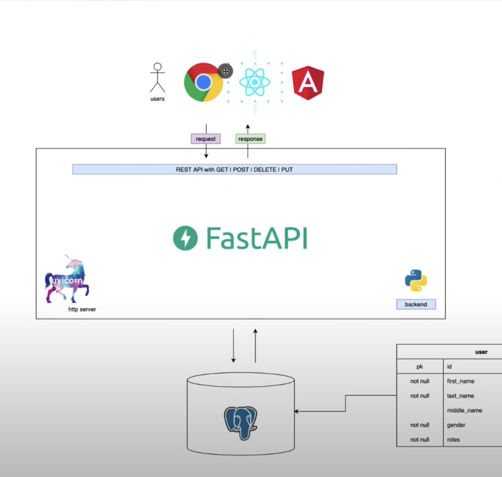

# Fast API Basics 


## Contents 

- [Install](#Install)
- [Notes](#Notes)
- [Build and run](#Build-and-run)
- [HTTP Methods](#HTTP-Methods)
- [Testing post requests](#Testing-post-requests)
- [Using Async](#Using-Async)
- [Swagger view](#Swagger-view)
- [Pydantic and Data Models](#Pydantic-and-Data-Models)
- [Flow](#Flow)
  

    

## Requirements  

- install fastapi [Fastapi Website](https://fastapi.tiangolo.com/)
- install uvicorn [uvicorn Website](https://www.uvicorn.org/)
- Pydantic for Model (datatype) validation [pydantic](https://pydantic-docs.helpmanual.io/)

## Install

```
pip install fastapi "uvicorn[standard"
pip install uvicorn
```


## Notes


Fast API is production ready. 

**FAST API IS JUST A FRAMEWORK**  

you also need a Uvicorn server which is a `ASGI` server (asynchronous service gateway)  

Uvicorn is similar to `express js`


## Build and run

- Make a main.py
- create a root
- run below:
  
```shell
uvicorn main:app --reload
```
  
- main is module name
- app is the instance of our application


## HTTP Methods
  
**Head** Request Resource representation  

**Head** Same as Get but does not return body
  
**Post** Submits an entity to a specified resource , often changing state in server

**Put** Put replaces all representations of target resource with current payload.  

**Delete** Delete a specified resource  
  
**Connect** Establishes a connection or tunnel to server.  


## Testing post requests

Use `thunder client` in vs code or postman
Switch to post
add the json body of the user and send


## Using Async

use async lets us use `await` 

```python
@app.get('/')
async def read_results():
    results = await some_library()
    return results
```

## Swagger view




## Pydantic and Data Models

- Use typing, pydantic (basemodel) and others in the models.py  
  
Examples:   
Note the `name:dataType` format.  
  
```python
class User(BaseModel):
	# gives a uuid if not provided
	id:           Optional[UUID] =  uuid4()
	first_name:   str
	last_name:    str
	middle_name:  Optional[str]
	gender:       Gender 
	roles:        List[Role]
```

## Flow 


